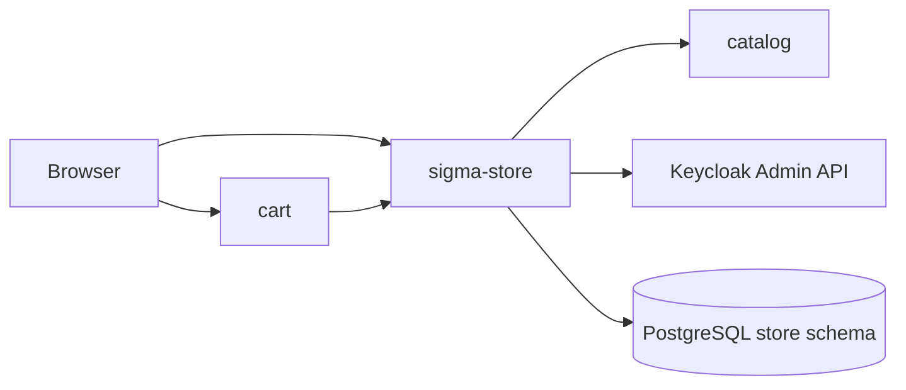

# sigma-store architecture

`sigma-store` is the public storefront and internal listing admin for Sigma Tactical Group. It publishes catalog SKUs with store-specific prices, links product detail to the info site, and posts add-to-cart forms to the cart service.

## Context

This service owns the PostgreSQL `store` schema and the `store.listings` table. Catalog SKU metadata is fetched at runtime and not duplicated locally.

## Runtime shape

The `sigma-store` binary delegates to `sigma_store::run()`, which validates configuration, connects the listing store to PostgreSQL, and hands `routes(store)` to `sigma_theme::warp::serve`. The theme crate supplies the Warp server, shared static assets, security headers, and the listen address from `PORT`.

Add-to-cart forms POST to the cart public URL; CSP `form-action` includes the cart origin.

## Request flow

`routes()` combines public storefront routes and admin listing management from `web.rs` with JSON handlers from `api.rs`. `sigma_theme::warp::site_routes` supplies `/up`, static assets, and error recovery; health routes report database connectivity.

`GET /` renders the storefront from active listings. `GET /products/{sku_code}` shows product detail with optional links to the info site (SIGMA-RACER). Admin routes under `/admin` manage listings and browse identity users when Keycloak is configured. The JSON API serves public `/items`, internal `/listings` CRUD, and `/users` from Keycloak.

## Code map

| Path | Responsibility |
| --- | --- |
| `src/main.rs` | Delegates startup to `sigma_store::run()`. |
| `src/lib.rs` | Defines `run()`, assembles routes, health, theme, and CSP. |
| `src/config.rs` | Reads public URLs, optional catalog and cart URLs, and Keycloak settings. |
| `src/store.rs` | Listing persistence. |
| `src/catalog.rs` | Runtime catalog SKU fetch. |
| `src/identity.rs` | Keycloak user directory for admin. |
| `src/product_url.rs` | Product and info-site URL helpers. |
| `src/web.rs` | Public storefront and admin HTML UI. |
| `src/api.rs` | Public `/items` feed and internal listings API. |
| `src/templates/` | Askama HTML for storefront and admin pages. |

## Data

PostgreSQL schema `store` holds listing rows mapping `sku_id` to display fields and `unit_price_cents`. Cart reads authoritative prices from the `/items` JSON feed, not from catalog.

## Configuration

| Environment variable | Purpose |
| --- | --- |
| `PORT` | Listen port supplied to the theme crate. |
| `STORE_CART_PUBLIC_URL` | Browser cart URL for add-to-cart forms and cart links. |
| `STORE_CONTACT_PUBLIC_URL` | Contact-service URL for the storefront contact form. |
| `STORE_IDENTITY_PUBLIC_URL` | Identity BFF URL for navbar links and CSP `connect-src`. |
| `STORE_PUBLIC_BASE_URL` | Canonical public URL of this storefront. |
| `STORE_INFO_PUBLIC_URL` | Info-service URL for SIGMA-RACER product detail links. |
| `STORE_CATALOG_BASE_URL` | Optional catalog integration for SKU metadata. |
| `STORE_CART_BASE_URL` | Optional internal cart URL for the navbar item-count badge. |
| `STORE_IDENTITY_ISSUER_URL` | Optional Keycloak issuer URL for admin user directory. |
| `STORE_IDENTITY_CLIENT_ID` | Optional service-account client id for Keycloak Admin API. |
| `STORE_IDENTITY_CLIENT_SECRET` | Optional service-account client secret for Keycloak Admin API. |

## Deployment

`Dockerfile` produces the `sigma-store` image. The platform deployment is at `../platform/services/store/base/deployment.yaml`; it exposes container port `8080` through `../platform/services/store/base/service.yaml` on service port `80`.

The public VirtualService and environment overlays reside beside the base manifests under `../platform/services/store/`. Production hostname and platform context are documented in [`../platform/README.md`](../platform/README.md).

## Testing

Run `cargo test -p sigma-store`. Integration tests in `src/lib.rs` cover CSP headers, the admin page, API listings and `/items`, and identity `503` when Keycloak is unconfigured. Tests use `sigma_pg::test_helpers::ready_store`.

## Design notes

- Prices live on store listings; catalog holds SKU identity and composition only.
- Guest and signed-in shoppers share the `sigma_cart` cookie domain when configured on cart.
- Admin UI is intended behind the identity BFF proxy in production.
